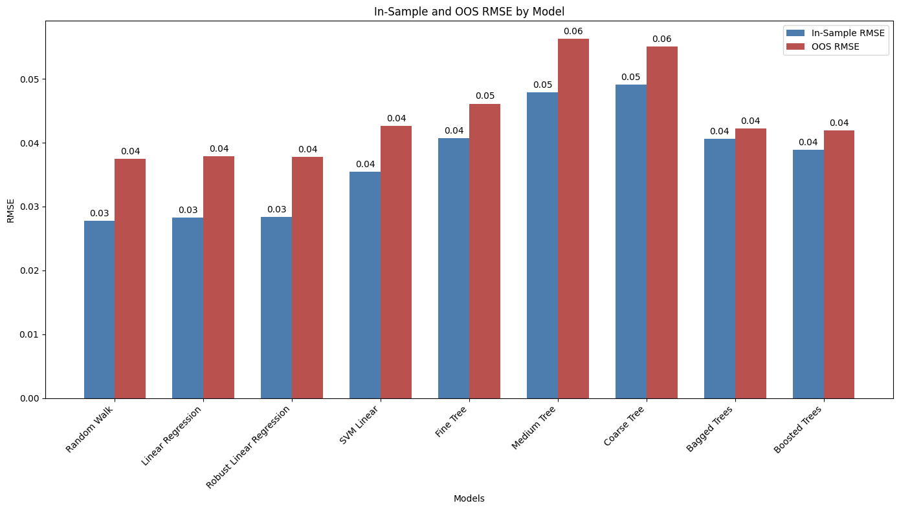
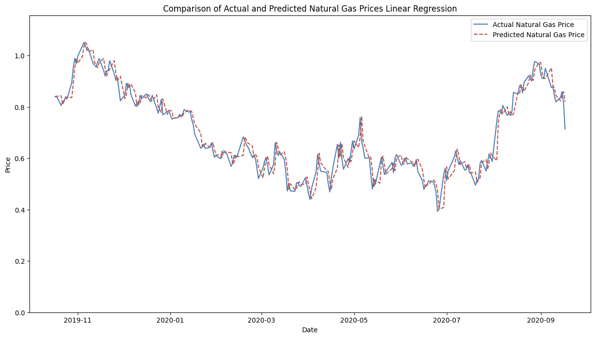
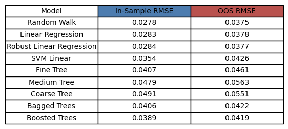

# Energy Price Prediction

This repository contains the code and report for the project titled "Energy Price Prediction". The project explores the application of various machine learning algorithms in forecasting natural gas spot prices, for the [Numerical Analysis for Machine Learning](https://www11.ceda.polimi.it/schedaincarico/schedaincarico/controller/scheda_pubblica/SchedaPublic.do?&evn_default=evento&c_classe=809914&__pj0=0&__pj1=f9ce19f0c7e1f043013c3ee4c68f43f1) course at PoliMi.

## Project Structure

- **energy_price_prediction.ipynb**: The Jupyter notebook containing the code for data preprocessing, model training, evaluation, and comparison.
- **project_report.pdf**: The final report detailing the methodologies, empirical results, and conclusions drawn from the project.
- **Images**: A directory containing images used in the report for visualizations and model comparisons.

## Abstract

This project evaluates the performance of several machine learning models, including linear regression, robust linear regression, support vector machines (SVM) with different kernels, Gaussian Process Regression (GPR), decision trees, bagged trees, boosted trees, and a naïve random walk model. The models are trained to forecast natural gas prices for one, three, five, and ten days ahead (t+1, t+3, t+5, and t+10).

The study highlights the effectiveness of linear and ensemble-based machine learning models in short-term natural gas price forecasting and underscores their potential utility for various stakeholders in the natural gas market.

## Sample Visualizations

### RMSE for t+1 Forecasting


### Comparison of Actual vs Predicted Prices (t+1)


### RMSE Table for t+1 time horizon



## Key Files

- **energy_price_prediction.ipynb**: The Jupyter notebook where the following steps are performed:
  - Data preprocessing: Handling missing values, feature scaling, and data splitting.
  - Model training: Training various machine learning models on the dataset.
  - Model evaluation: Evaluating the models using Root Mean Square Error (RMSE) for both in-sample and out-of-sample data.
  - Model comparison: Comparing the performance of different models and selecting the best ones.

- **project_report.pdf**: The comprehensive report containing:
  - Introduction to the importance of natural gas price forecasting.
  - Detailed methodology including descriptions of the machine learning models used.
  - Empirical results for each forecasting horizon (t+1, t+3, t+5, t+10).
  - Conclusions drawn from the results, emphasizing the best-performing models.

## Dataset

The dataset used in this study comprises 2423 daily observations of natural gas spot prices from December 3, 2010, to September 18, 2020. The data was sourced from the [Energy Information Administration (EIA)](https://www.eia.gov/dnav/ng/hist/rngwhhdW.htm) and supplemented with 21 related economic variables from the Federal Reserve Bank of Saint Louis and Yahoo Finance databases.


## Dependencies

To run the Jupyter notebook, you need the following Python libraries:
- numpy
- pandas
- scikit-learn
- matplotlib

You can install these dependencies using pip:
```bash
pip install numpy pandas scikit-learn matplotlib seaborn
